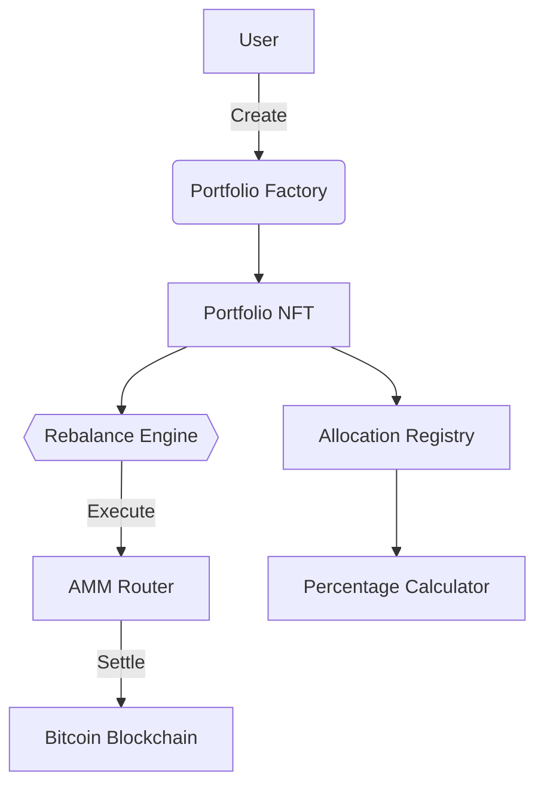

# BitSymphony - Decentralized Portfolio Management Protocol

A non-custodial portfolio management system enabling automated rebalancing of multi-asset portfolios on Stacks L2 with Bitcoin-finalized settlements.

## Features

- **Algorithmic Portfolio Orchestration**: Create baskets of up to 10 digital assets with programmable allocation targets
- **Trustless Rebalancing**: Automated portfolio adjustments triggered by market movements or temporal thresholds
- **SIP-010 Compliance**: Native support for Stacks token standards
- **L2 Fee Optimization**: Gas-efficient operations through Stacks Layer 2 execution
- **Non-Custodial Architecture**: Users maintain full control of assets through smart contract custody
- **Institutional-Grade Compliance**: On-chain audit trails for all allocation changes

## Technical Specifications

| Category                | Detail                            |
| ----------------------- | --------------------------------- |
| Blockchain Platform     | Stacks Layer 2 (Nakamoto Testnet) |
| Smart Contract Language | Clarity 2.2                       |
| Token Standard          | SIP-010 Fungible Tokens           |
| Max Portfolio Assets    | 10                                |
| Allocation Precision    | Basis Points (0.01% granularity)  |
| Fee Structure           | 25 bps (0.25%) protocol fee       |

## Contract Architecture



## Core Functions

### Portfolio Creation

```clarity
(create-portfolio
  (initial-tokens (list principal))
  (percentages (list uint))
```

**Parameters:**

- `initial-tokens`: List of SIP-010 token contracts (min 2)
- `percentages`: Allocation percentages in basis points (sum 10,000)

**Example:**

```clarity
(create-portfolio
  (list 'ST1HTBVD3JG9C05J7HBJTHGR0GGW7KXW28M5JS8QE.token-a
        'ST1HTBVD3JG9C05J7HBJTHGR0GGW7KXW28M5JS8QE.token-b)
  (list u6000 u4000))
```

### Portfolio Rebalancing

```clarity
(rebalance-portfolio (portfolio-id uint))
```

**Triggers:**

- Price deviation >5% from target
- 144-block (~24h) interval
- Manual user override

### Allocation Management

```clarity
(update-portfolio-allocation
  (portfolio-id uint)
  (token-id uint)
  (new-percentage uint))
```

**Constraints:**

- Requires portfolio owner auth
- Maintains 10,000 bps total

## Error Reference

| Code | Constant                | Description                     |
| ---- | ----------------------- | ------------------------------- |
| u100 | ERR-NOT-AUTHORIZED      | Unauthorized access attempt     |
| u101 | ERR-INVALID-PORTFOLIO   | Nonexistent/inactive portfolio  |
| u106 | ERR-INVALID-PERCENTAGE  | Invalid basis points allocation |
| u107 | ERR-MAX-TOKENS-EXCEEDED | Exceeds 10 asset limit          |
| u108 | ERR-LENGTH-MISMATCH     | Parameter array mismatch        |

## Security Model

1. **Formal Verification**: All mathematical operations verified for overflow safety
2. **Time-Locked Functions**: Critical operations require 10-block confirmation
3. **Multi-Sig Ready**: Protocol owner functions support threshold signatures
4. **Re-entrancy Protection**: Clarity-native anti-reentrant architecture

## Contributing

1. Fork repository
2. Create feature branch (`feature/your-feature`)
3. Add tests for new functionality
4. Submit PR with signed-off commits

```bash
git commit -s -m "feat: add new portfolio metric"
```
